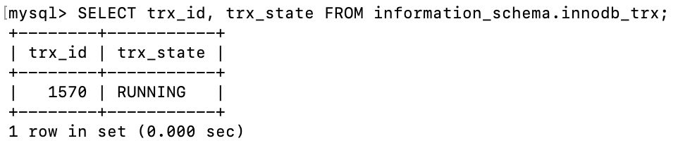
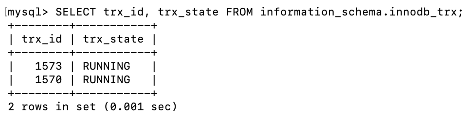
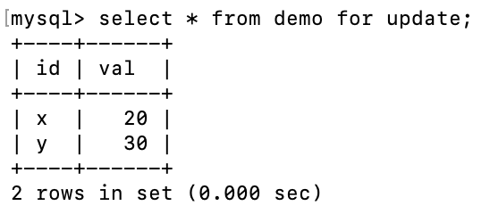

### 1. 可以更快吗?
在[上一篇笔记中](https://aspartame4990.github.io/posts/Collection-Mysql/Collection-Mysql-01.html), 我们谈到`强严格两阶段锁(SS2PL)`配合`谓词锁`可以实现`可串行化(Serializable)`隔离级别。

但是SS2PL为了做到可串行化，读写会相互阻塞，例如：

1. 一开始，小明有 $1000$ 元，小红有 $2000$ 元
2. 事务A是小明给小红转账 $100$ 元，这是一个涉及到写入的事务，可能会花费一段时间才能完成
3. 事务A执行期间，事务B想要查询小明和小红的总余额。按照SS2PL，事务B会被阻塞。
4. 事务A执行结束，释放写锁
5. 事务B获得读锁, 查询到小明有 $900$ 元，小红有 $2100$ 元，总共有 $3000$ 元。

可是，对于事务B来说，无论事务A有没有完成，总余额都是不变的。换句话说，我们不需要最新的数据，只要数据看起来合理(符合**一致**性)就够了。但是SS2PL为了保证事务B能读到最新的数据，强行阻塞了事务B。

那么我们该如何改进SS2PL，使得这些“不需要最新数据”的读取不会被阻塞呢?

一种直观的想法是，把读取分为2种，一种是SS2PL的正常加锁读，另一种是“无锁读取”。对于查询余额这种不要求最新数据的事务来说，用“无锁读取”就够用了。但是，单纯的“无锁读取”存在隐患：

1. 一开始，小明有 $1000$ 元，小红有 $2000$ 元
2. 事务A是小明给小红转账 $100$ 元，这是一个涉及到写入的事务，可能会花费一段时间才能完成。现在事务A只完成了`小明 -= 100`。
3. 事务B想要“无锁读取”小明和小红的总余额，查明小明余额为 $900$ ，小红余额 $2000$ 元，总余额 $2900$ 元，返回了错误的结果
4. 事务A接着执行`小红 += 100`，然后`COMMIT`

可见，单纯的“无锁读取”会读取到未提交的事务的数据，也就是“脏读”。     
那么问题来了，如何让“无锁读取”也能读取到**一致**的数据呢?    
MVCC给出了这个问题的答案。 

### 2. 问题的形式化

在介绍MVCC之前，我们先来明确2个概念:

- **一致**性: 
  我们在之前多次提到了一致这个概念, 一致到底是什么呢？ 一致其实是数据始终应该成立的约束，根据业务逻辑的不同而不同，例如在银行中，一致就代表`总余额不变`。

- **状态**:   
    如果我们把数据库系统看成一个状态机，那么数据就构成了状态。     
    状态转移函数就是对于数据库的原子操作，例如读取或写入。   
    事务是由状态转移函数和不影响状态的本地计算所构成的复合函数。

在上面的例子中，我们可以定义以下几个状态：

* $S_0$：初始的一致状态（小明 $1000$，小红 $2000$ ）。
* $S_{0.5}$：事务 $T_A$ 执行到一半时的不一致中间状态（小明 $900$ ，小红 $2000$ ）。
* $S_1$：事务 $T_A$ 完成并提交后的一致状态，即 $S_1 = F_{T_A}(S_0)$（小明 $900$，小红 $2100 $）。

不同的并发控制算法，决定了事务 $T_B$ 读到的是什么：

1.  **SS2PL：** 事务 $T_B$ 被阻塞，强行等待 $T_A$ 执行完毕，最终读取到的是最新的、一致的 $S_1$。
2.  **“无锁读取” + SS2PL：** 事务 $T_B$ 不等待，读取到了不一致的中间状态 $S_{0.5}$，导致了错误。

我们之前的问题"如何让无锁读取也能读取到一致的数据", 现在可以形式化的描述为，如何让事务$T_B$能读取到初始状态$S_0$，既能避免强制等待经过事务$T_A$转化后的状态 $S_1 = F_{T_A}(S_0)$，也能避免读取到不一致的中间状态 $S_{0.5}$?

MVCC的回答是: 保留所有历史状态! ~~暂不考虑垃圾回收~~

### 3. MVCC的理论原理

MVCC维护了当前所有已提交事务的集合，我们用集合
$$ReadView(T) = \{T'| T'的COMMIT时间 早于 T的创建时期 \}$$

来记录当新事务$T$创建时，数据库中有哪些已经提交的事务。

在上面的例子中，
$$ ReadView(T_A) = \{ T_0 \} $$
$$ ReadView(T_B) = \{ T_0 \} $$

其中$T_0$是最初创建了小明= $1000$ ，小红= $2000$ 的事务

对于数据，则进化成了一串标记了修改事务的历史记录，在计算机中的实现为链表，
$$ \fbox{数据, $T_x$} \to \fbox{数据, $T_y$} \to \dots \to \fbox{数据, $T_z$} $$

其中$T_x$、$T_y$、$T_z$分别是产生了这个修改历史的事务名。

每当事务$T$想要修改数据时，并非简单的修改，而是先给链表上写锁，然后在链表的头部插入修改记录，也就是新数据和自己的名字$T$
$$ \fbox{新数据, $T$} \to \dots$$

对于正常的加锁读，需要给链表上读锁，然后读取链表头部的最新记录。这种读取在MySQL中被称为**当前读(Locking Read)**。

对于无需读取最新记录的“无锁读取”，这是MVCC真正优化的操作，它不需要加锁，而是拿着自己的$ReadView(T)$，从链表的头部开始依次向下遍历，通过修改事务的名称$T'$, 根据以下规则判断可见性：

- 如果节点事务 $T = T'$，说明是自己改的，可见。
- 如果节点事务 $T' \in ReadView(T)$，说明在 $T$ 创建时 $T'$ 已提交，是一个一致的历史状态，安全可见。
- 如果 $T' \notin ReadView(T)$ 且 $T \neq T'$，说明这是未提交或未来的修改，不可见，顺着指针继续检查下一个节点。

这种不加锁的、沿着历史记录找可见版本的读取在MySQL中被称为**快照读(Consistent Nonlocking Read)**。

现在，我们重新回到小明给小红转账的例子，看看MVCC能否让事务$T_B$读取到一致的状态$S_0$。

1. 最初, 事务 $T_0$ 给小明写入 $1000$ 元，给小红写入 $2000$ 元
   $$ \text{小明} \quad \fbox{1000, $T_0$} $$
   $$ \text{小红} \quad \fbox{2000, $T_0$} $$

2. 事务$T_A$启动，获取已提交事务集合
    $$ ReadView(T_A)= \{ T_0 \} $$
    
3. 事务$T_A$执行`小明 -= 100`，小明的历史记录链被修改
      $$ \text{小明} \quad \fbox{900, $T_A$} \to \fbox{1000, $T_0$} $$
        
      $$ \text{小红} \quad \fbox{2000, $T_0$} $$
4. 事务$T_B$启动，获取已提交事务集合，
   $$ ReadView(T_B)= \{ T_0 \} $$
   注意此时事务$T_A$尚未提交，因此$ReadView(T_B)$中不包括$T_A$
5. 事务$T_B$读取小明和小红的余额，它会拿着自己的 $ReadView(T_B)$ 遍历小明和小红的链表.   
   首先检查小明的头节点 $$\text{小明} \quad  \fbox{900, $T_A$} \to \dots $$
   发现 $T_A$ 既不等于自身，也不属于 $ReadView(T_B)$，因此这条修改记录不是在$T_B$诞生之前产生的。

   然后检查小明的下一个节点 $$\text{小明} \quad \dots \to \fbox{1000, $T_0$}$$
   因为 $T_0 \in ReadView(T_B)$, 故这条修改记录可见，返回小明的余额为$1000$。   
   接着查询小红的余额，检查小红的头节点 $$\text{小红} \quad \fbox{2000, $T_0$} $$，
   因为 $T_0 \in ReadView(T_B)$, 故这条修改记录可见，返回小红的余额为$2000$。
   事务$T_B$最终返回余额 $1000 + 2000 = 3000$ 并提交，符合一致性。

我们不妨完整的推演，如果 $T_A$ 提交之后又来了一个新的事务 $T_C$ 来查询小明和小红的余额会怎样?

6. 事务 $T_A$ 继续执行`小红 += 100`，小红的历史记录链被修改。随后，事务 $T_A$ 顺利提交。此时的数据链表状态为：
   $$\text{小明} \quad \fbox{900, $T_A$} \to \fbox{1000, $T_0$}$$
   $$\text{小红} \quad \fbox{2100, $T_A$} \to \fbox{2000, $T_0$}$$

7. 新的事务 $T_C$ 启动，想要查询小明和小红的总余额。它获取当前已提交事务集合：
   $$ReadView(T_C) = \{T_0, T_A, T_B\}$$
   注意，由于此时 $T_A$ 和 $T_B$ 已经提交，因此 $T_A$ 和 $T_B$ 也被包含在了 $T_C$ 的可见集合中。

8. 事务 $T_C$ 拿着自己的 $ReadView(T_C)$ 开始读取小明的余额。首先检查小明的头节点：
   $$\text{小明} \quad \fbox{900, $T_A$} \to \dots$$
   发现节点事务$T_A \in ReadView(T_C)$，根据可见性规则，说明这条修改记录在$T_C$诞生前已提交，可见。返回小明的余额为 900。

   接着，事务 $T_C$ 读取小红的余额。检查小红的头节点：
   $$\text{小红} \quad \fbox{2100, $T_A$} \to \dots$$
   同样发现节点事务$T_A \in ReadView(T_C)$，可见, 返回小红的余额为 $2100$。   
   事务$T_C$计算总余额：$900 + 2100 = 3000$。返回正确结果并提交。


### 4. undo log里的TRX_ID是单调递减的吗
在上面的讨论中，我们用唯一的字符串(例如 $T_A$、$T_B$)来唯一的标识一个事务，用字符串的集合 $ReadView$ 来进行可见性判断。可是真实的数据库是如何实现的呢？真的用字符串来标识一个事务吗，用字符串的集合充当 $ReadView$ 吗？    

在 MySQL 里，这两个概念会落到更具体的数据结构上：

- `TRX_ID`, 写事务的数字编号:   
   MySQL 不会用 "$T_A$" 这样的字符串标识事务，而是用一个递增的事务 ID。一个事务通常在第一次进行写操作时分配 `TRX_ID`（只读事务一般不会占用写事务 ID）。

- `ReadView`：不是“已提交事务集合”，而是“活跃事务列表”
   $$
   ReadView_{MySQL} = (m\_ids,\ min\_trx\_id,\ max\_trx\_id,\ creator\_trx\_id)
   $$
   其中 `m_ids` 是创建快照那一刻仍然活跃的读写事务 ID 列表；`min_trx_id` 是其中最小值；`max_trx_id` 是下一次将要分配的事务 ID；`creator_trx_id` 是当前事务自己。
   可见性判断规则为:
   - 若 `trx_id == creator_trx_id`，可见（自己改的）。  
   - 若 `trx_id < min_trx_id`，可见（快照创建前就已提交）。  
   - 若 `trx_id >= max_trx_id`，不可见（快照创建后才产生）。  
   - 否则看 `trx_id` 是否在 `m_ids` 中：在则不可见（当时仍活跃），不在则可见（已提交）。

这就是前文“用字符串集合判断可见性”的工程化实现。

看到这里，一个非常自然的问题是：   
既然快照读是“从新版本一路往旧版本回溯”，那么沿着版本链看到的 `TRX_ID` 会不会总是单调递减呢？     
直觉上，好像应该如此。因为“新版本”看起来应该由“更新的事务”产生，而“旧版本”看起来应该由“更旧的事务”产生，于是就容易想当然地认为：   

$$
\text{对于所有的版本链} \quad \dots \to \fbox{数据, $T_x$} \to \fbox{数据, $T_y$} \to \dots
$$
$$ T_x \ge T_y \quad \text{总是成立}$$

但是，这个结论其实是错的,请看下面的反例:

1. 初始状态： 表中有两行数据，$x=10$，$y=10$。
   $$ x \quad \fbox{10, $T_0$} $$
   $$ y \quad \fbox{10, $T_0$} $$

2. $T_a$ 启动并首次写入： $T_a$ 执行 `UPDATE table SET val=20 WHERE id='x'`。   
   此时，MySQL为$T_a$分配了一个较小的事务ID，假设 `TRX_ID = 1570`。
      $$ x \quad \fbox{20, 1570} \to \fbox{10, $T_0$} $$
      $$ y \quad \fbox{10, $T_0$} $$
3. $T_b$ 启动并写入`y`： $T_b$ 执行`UPDATE table SET val=20 WHERE id='y'`。
   MySQL 为 $T_b$ 分配了更大的事务 ID，假设 `TRX_ID = 1573`。
      $$ x \quad \fbox{20, 1570} \to \fbox{10, $T_0$} $$
      $$ y \quad \fbox{20, 1573} \to\fbox{10, $T_0$} $$
4. $T_b$ `COMMIT`, 并释放了`y`的锁。
5. $T_a$ 恢复并修改同一行： $T_a$ 接着执行 `UPDATE table SET val=30 WHERE id='y'`。因为它使用的是早前分配的 `TRX_ID = 1570`，且 $T_b$ 已释放`y`的锁，修改成功。
      $$ x \quad \fbox{20, 1570} \to \fbox{10, $T_0$} $$
      $$ y \quad \fbox{30, 1570} \to \fbox{20, 1573} \to\fbox{10, $T_0$} $$

下面我们通过实验侧面印证这个例子。

1. 首先，创建初始数据
   ```
   +----+------+
   | id | val  |
   +----+------+
   | x  |   10 |
   | y  |   10 |
   +----+------+
   ```

2. 在`终端A`中执行 $T_a$ 的  `UPDATE table SET val=20 WHERE id='x'`     
   此时通过`终端C`，可以查询到 $T_a$ 的 `TRX_ID` 为 `1570`
   {width=100% fig-align="center"}
3. 在`终端B`中执行 $T_b$ 的  `UPDATE table SET val=20 WHERE id='y'`
   此时通过`终端C`，可以查询到 $T_b$ 的 `TRX_ID` 为 `1573`
   {width=100% fig-align="center"}
4. $T_b$ `COMMIT`, 并释放了`y`的锁。
5. 在`终端A`中继续执行 $T_a$ 的  `UPDATE table SET val=30 WHERE id='y'`
6. $T_a$ `COMMIT`, 并释放了`y`的锁。  
7. 在 $T_a$ 和 $T_b$ 都提交后，再查询`y`的值，发现是 $30$，说明链表的头部是由 `TRX_ID` 更小的 $T_a$ 写入的, 这就侧面印证了`undo log`里的`TRX_ID`并非严格单调递减。
{width=60% fig-align="left"}

### 5. 总结

事务的生命周期有4种顺序:

- $ReadView$ 描述的是 `事务的诞生顺序`
  $$  ReadView(T_A) \supseteq ReadView(T_B) \implies T_{start}(T_A) > T_{start}(T_B)$$

- `TRX_ID`描述的是`事务第一次写入的顺序`, 如果 $T_A$ 的`TRX_ID`大于 $T_B$ 的`TRX_ID`, 说明 $T_A$ 的第一次写入晚于 $T_B$ 的第一次写入。 MySQL复用了这个自增ID作为事务的全局唯一标识。
   $$ TRX\_ID(T_A) > TRX\_ID(T_B) \implies T_{first\_write}(T_A) > T_{first\_write}(T_B) $$

- `版本链的先后`描述的是事务对具体数据行拿到`写锁`的顺序，如果在版本链上，$T_A$ 比 $T_B$ 更靠近头节点，说明对于这一行来说， $T_A$ 获取写锁的时间晚于 $T_B$ 
   $$\text{数据行}x \quad \dots \to \fbox{数据, $T_A$} \to \fbox{数据, $T_B$} \to \dots \implies T_{lock}(T_A, x) > T_{lock}(T_B, x)$$

- `事务的提交顺序`对应于MVCC维护的已提交事务的集合的膨胀过程。
   $$ T_A \text{ 加入已提交集合的时间晚于 } T_B  \implies T_{commit}(T_A) > T_{commit}(T_B)  $$

这4个顺序不一定相同。


> 欢迎感兴趣的朋友批评指正!